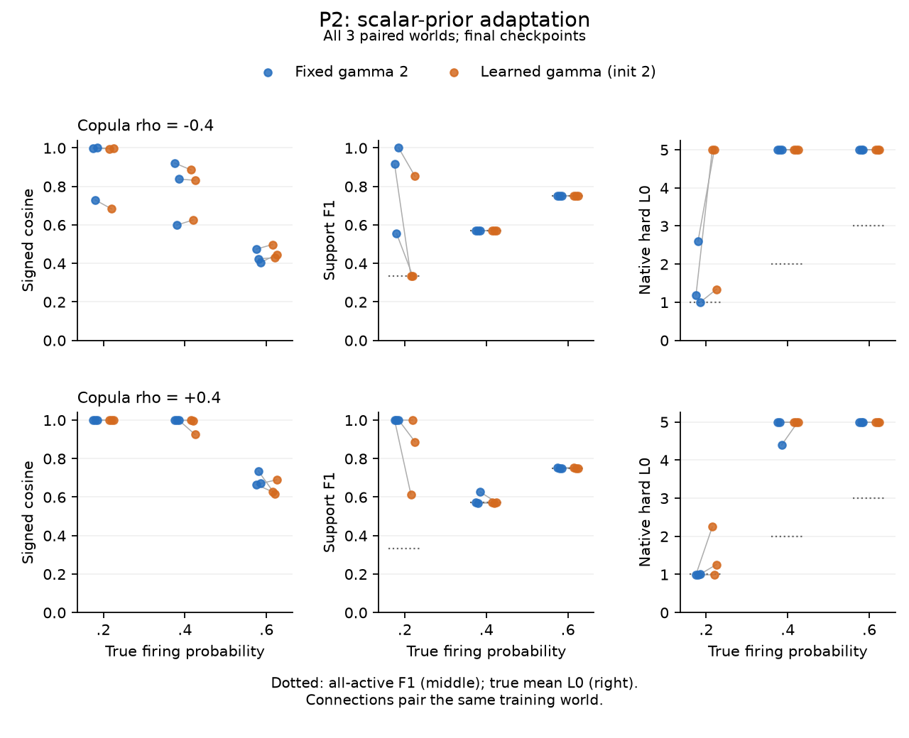
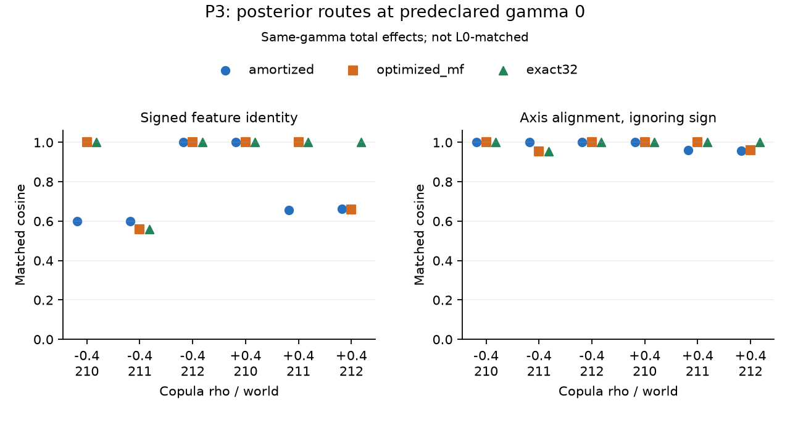

# Sparse but Wrong에 기반한 VG-SAE 방법 개발

실행 `vg-sae-sparse-but-wrong-20260922` · 2026-09-22 · 상태: idea-discovery 완료 · 제안서 REVISE, 후속 확증 실험은 계획 단계.
사용자의 원래 아이디어인 **Variational Garrote 기반 새로운 SAE 개발**이 주 연구다.
참조 논문의 feature 혼합 문제를 핵심 동기로 두고 L1 이외의 support 선택 원리를 검증한다.
이전 결과는 [보존본](runs/vg-sae-sparse-but-wrong-20260922/prior_development_snapshot/README.md)에 있다.

## Problem Anchor

Sparse but Wrong가 제기한 잘못된 희소성 수준과 feature 혼합 문제를 출발점으로,
L1 진폭 벌점에 의존하지 않는 Variational Garrote 기반 새로운 SAE를 개발한다.
확률적 support 선택과 amplitude 추정이 실제 feature 복원을 개선하고, 올바른 활성 수를
모르는 상황에서 희소성 설정에 따른 오류를 줄이는지 검증한다. 주 연구는 VG-SAE 방법
개발이며, 재구성–희소성 곡선·decoder 진단은 성공의 대리 목표가 아니라 이를 검증하는 도구다.

## Reference Paper

[논문 요약](REF_PAPER_SUMMARY.md)이 이번 실행의 출발점이다. 잘못된 L0와 feature 혼합,
재구성–희소성 곡선의 한계를 직접 평가한다. 논문 자체가 VG의 성공을 입증했다거나
L1 전반의 실패를 결론냈다고 기술하지 않는다.

## Literature Landscape

[핵심 15편 비교](runs/vg-sae-sparse-but-wrong-20260922/evidence/literature_update.md)와
[35개 registry](runs/vg-sae-sparse-but-wrong-20260922/evidence/literature_sources.json)를 갱신했다.
기존 32개에 AFA, MDL-SAE, Anthropic JumpReLU recipe를 더했다. 20개 query/11개 형태와
arXiv helper의 22개 unique metadata를 검토했다. 최근 6개월 창은 2026-03-22–09-22다.

L1 shrinkage 대안은 이미 Gated/JumpReLU/TopK 및 variational sparse coding에 있다.
AFA의 lambda, SoftSAE의 target K, MDL의 coding/허용오차, VG의 gamma가 남으므로
입력별 활성 수를 조절하는 능력과 true support를 찾는 능력을 구분해야 한다.
고정 gamma를 포함한 VG의 전체 operating curve와 실제 feature recovery가 핵심 검증이다.
논문에 사용된 Anthropic JumpReLU는 현재 프로젝트 기본 step-loss JumpReLU와
다른 tanh/pre-act recipe이므로 baseline 이름만 같은 비교를 하지 않는다.
이전 novelty 점수는 이번 anchor의 승인으로 사용하지 않는다.

## Ranked Ideas

두 개의 독립 Astra ultra 생성기가20개 원안을 냈고, 의미가 가까운 항목을13개 family로 묶었다.
모든 variant를 보존했으며 prior-art 이웃이나 낮은 기대 점수만으로 제외한 후보는 없다.
[원안·통합 pool](runs/vg-sae-sparse-but-wrong-20260922/evidence/candidate_pool.json),
[fresh jury](runs/vg-sae-sparse-but-wrong-20260922/evidence/pilot_jury.json)가 근거다.

| 순위 | 경로 | 사전 배정 |
|---:|---|---|
| 1 | S01: 현재 VG의 feature identity 복원 | select:P1 |
| 2 | S06: Joint/block support posterior | select:P3 |
| 3 | S02: 정규화된 global prior 학습 | select:P2 |
| 4 | S04: Sparsity continuation | reserve:first |
| 5 | S05: Residual support teacher | defer |
| 6 | S09: Precision timescale | defer |
| 7 | S11: 상관된 support prior | defer:high_upside_preserved |
| 8 | S07: Amplitude stationarity | defer |
| 9 | S03: Feature별 빈도 prior | defer |
| 10 | S10: 학습 간 feature 안정성 selector | defer |
| 11 | S08: 명시적 slab uncertainty | defer:high_upside_preserved |
| 12 | S12: Hard-code decoder 학습 | defer |
| 13 | S13: Gate uncertainty selector | defer |

P1은 기본 방법의 경쟁력, P2는 작은 prior 적응, P3는 평균장 family와 amortization을
분리하는 고위험 경로다. 이 세 경로만 실행하며 나머지는 후속 후보로 남긴다.
두 generator는 사용자 ultra 지정에 따라 모두 GPT-6 Astra다. 서로 다른 모델 family의
독립 검증으로 표현하지 않는다.

## Pilot Results

세 경로에서 총 **351회 학습**을 완료했다(P1 225, P2 72, P3 54).
이는351개의 독립 training seeds가 아니다. 각 pilot은3개의 paired worlds를 사용한다.
Paper-inspired5-feature toy이며 원 논문의 online15M-sample 실험을 재현한 결과로 부르지 않는다.

### P1: 현재 VG의 가능성과 비교 한계

225 models,675 calibration checkpoints,254개 고유 test checkpoints를 평가했다.
전체225 final grid를 포함한다. Protocol과 선택을 test 전에 동결했고 failed run은 없었다.

| 확인 항목 | 실제 결과 | 허용되는 해석 |
|---|---|---|
| Primary target L0 1.8 | VG coverage0/9 | 비교 미해결; 우위·실패·robust plateau 모두 미입증 |
| Target L0 2 | VG coverage7/9, signed cosine .9999857–.9999941, F1 .9999847–1 | 적절한 구간에서 방법의 복원 가능성 |
| Strong-baseline superiority | 부호별2/3 worlds의 사전 joint 우위 기준 미충족 | 넓은 VG 고유 이득은 미확인; 등가성 입증도 아님 |
| Anthropic JumpReLU | 모든 target에서 coverage0 | 적절히 tuned Jump에 대한 비교 미해결 |
| L1 amplitude rescale | Matched5 pairs 모두 NMSE/MSE 개선, D/support 동일 | 단순 amplitude bias 대조의 필요성 |
| Rescale 후 VG coefficient NMSE | 5 pairs 중4개에서 VG가 여전히 낮음 | 제한된 L1-alternative 신호; objective-only 인과효과는 아님 |

예를 들어 rho−.4/world211의 coefficient NMSE는 VG .0001063, native L1 .0697171,
rescaled L1 .0132759다. 반대로 rho0/world212는 rescaled L1 .00009558이 VG
.00012410보다 낮았다. NMSE와 square-root relative error를 섞지 않는다.

**Decoder만 좋아도 support는 틀릴 수 있다.** Truth-free min-c_dec 선택은
rho+.4/world212에서 VG gamma2를 골라 signed cosine .99971이지만 native L0
4.39465/F1 .62633을 냈다. Gamma2의 rho별 평균 L0는5/5/4.798이며 EV는 모두 .999 이상이다.

Jump의 최소 penalty .03도 평균 L0 약 .67–1.00을 만들었다. 더 낮은 penalty와
recipe/convergence를 조율할 필요가 있다. Width·data·후보 수는 같지만 parameter 수는
VG330/L1225/Gated235/Jump230/BTK225로 다르고 공식 normalization도 보존했다.
같은 capacity 또는 VG objective만의 우위라고 쓰지 않는다. 서로 다른 covered sets의
평균을 직접 빼지 않고 paired worlds로 비교한다.

[해석](runs/vg-sae-sparse-but-wrong-20260922/evidence/pilots/baseline/interpretation.md) ·
[전체 표](runs/vg-sae-sparse-but-wrong-20260922/evidence/pilots/baseline/test_metrics.csv) ·
[사전 선택](runs/vg-sae-sparse-but-wrong-20260922/evidence/pilots/baseline/frozen_selection.json).

### P2: scalar prior 학습은 현재 recipe에서 지지되지 않음

72 models를 CPU에서3 worlds×p(.2/.4/.6)×rho(−.4/+.4)×4 arms로 비교했다.
Primary learned-init2 대 fixed2의 joint 개선 기준은 **0/18**이었다.
초기값−2/2/6의 signed-cosine 범위가 .05 이내인 cell은1/18이었다.

p=.2,rho+.4의3-world 평균에서 fixed2는 cosine .99998/F1 .99999/L0 .99563,
learned-init2는 .99941/.83398/1.49744였다. p=.4,rho−.4에서는 두 recipe 모두
L0=5, EV>.999인데 F1는 .57078이었다. p=.6의 F1 약 .75도 all-active predictor의
값인 `2p/(1+p)`와 같아 유용한 support 선택의 증거가 아니다.

**수렴한 잘못된 prior를 입증한 실험은 아니다.** Full train-set 사후 진단에서 primary18개
중14개는 최종 |dF/dgamma|>2였다. 유한 예산의 gradient recipe 비지지이며 clipping,
precision scale, duration 중 무엇이 원인인지는 미확인이다. 정상조건 `pi=mean(m)`가
true L0를 보장하지 않는다는 수식상의 관찰과 이 실험의 미수렴을 구분한다.

[원본·판정](runs/vg-sae-sparse-but-wrong-20260922/evidence/pilots/prior/analysis.json) ·
[설명](runs/vg-sae-sparse-but-wrong-20260922/evidence/pilots/prior/findings.md).

### P3: joint posterior의 제한된 total-effect 신호

Fixed beta10에서 amortized product / optimized product MF / exact32를54 fits로
비교했다. 162개 calibration checkpoints 이후54개 final models를 한 번 평가했다.
Exact/MF의 matched-L0 case는 **4/18**, 고유 checkpoint pair는3개였고 joint 성공은0이었다.

rho+.4/world212/gamma0에서는 optimized MF→exact의 signed cosine .660610→.999589,
F1 .755444→.956572, L0 2.918274→2.185791이었다. Common marginal readout에서도
exact F1 .968123으로 신호가 남았다. **이 한 world의 전체 효과는 유효하다.**
L0 불일치가 총효과를 없애지는 않지만 density와 분리한 고유 covariance 이득도 입증하지 않는다.
나머지5개의 gamma0 worlds는 exact/MF dictionary cosine 차이가 .00034보다 작았다.

MAP와 marginal readout만으로 F1가 달라지는 다른 사례도 있었다. 또한 frozen
`mixing_energy`는 signed-assignment leakage라 순수 부호/할당 오류도 포함한다.
예를 들어 negative world210의 amortized cosine은 signed .60075, absolute .99966이다.
이 경우 큰 leakage 감소를 실제 다중 feature의 기하학적 분리라고 부르지 않는다.
전체54모델 projection 분해에서 positive world212는 부호와 실제 혼합의 개선이 함께 확인됐다.

MF 최저 training-batch convergence는99.15%이며 비수렴81 samples도 버리지 않았다.
Final test4 fits에는 각1개의 비수렴 sample이 있어 해당 기전 귀속은 유보한다.
Exact32는5 latents의 판별 실험이며 scalable SAE나 이미 채택한 architecture가 아니다.

[결과와 해석 보완](runs/vg-sae-sparse-but-wrong-20260922/evidence/pilots/joint/RESULTS.md) ·
[54개 최종 표](runs/vg-sae-sparse-but-wrong-20260922/evidence/pilots/joint/final_metrics.csv).

### 계산량과 실행 범위

P1 scientific wall2796.93초와 throughput4.46초의 합은 약 **.7782 GPUh**다.
Import·개별 테스트·plumbing 시간은 이 타이머에 포함되지 않는다. GPU1에서 실행했고
다른 사용 중인 GPU 작업을 건드리지 않았다. P2는 CPU3 processes의 wall합800.54초
(최대 개별269.85초), P3는 CPU wall549.83초였다. CPU시간을 GPUh로 합산하지 않는다.
큰 checkpoint/캐시는 outputs에 두고 재검토 가능한 작은 수치만 이 run에 보존했다.

## Novelty Verification

Fresh reviewer `/root/sbw_novelty`, GPT-6 Astra ultra의 실제 verdict는
**PROCEED WITH CAUTION, 5.5/10**이다. Same-family provisional이다.
[36개 query와28개 primary comparison](runs/vg-sae-sparse-but-wrong-20260922/evidence/novelty_search.json)을
확인했고 같은 VG-SAE 결과를 이미 포함하는 named published duplicate는 발견하지 못했다.

특정 CAUTION은 기존 VG의 amortization과 point-amplitude specialization이라는
좁은 delta를 실제 signed feature/support 복원 또는 compute–accuracy 이득이
뒷받침해야 한다는 것이다. Generic probabilistic SAE, support/amplitude 분리,
analytic VI 최초성은 주장하지 않는다. PMF/S3C의 spike–자기 slab coupling과
S06의 서로 다른 support 간 joint posterior는 구분한다.
최근 AdaptiveK/iSAE/self-consistency regularizer도 직접 경쟁으로 기록했다.
선행이 가깝다는 이유만으로 원래 VG 연구를 폐기하지 않는다.

## External Critical Review

Fresh reviewer `/root/sbw_critical_review`, GPT-6 Astra ultra의 최종 연구 지속 판정은
**PROCEED WITH CAUTION**이다. Same-family provisional이며 논문 준비 판정이 아니다.
제안서의 현재 평가점수는 **7.85/10, REVISE, CALIBRATION:none**이다.
핵심은 문장이나 component 수가 아니라, 유용한 고유 이득과 비-oracle 선택 근거가
아직 부족하다는 것이다. 점수를 올리기 위해 원래 연구 목표를 바꾸지 않는다.

검토에 따라 P2의 nonstationarity, P3의 total effect와 density-controlled claim,
부호/실제 혼합, P1의 coverage와 strong-baseline 한계를 구분했다. 독립 code audit도
blocking 수식·구현 오류는 발견하지 못했지만 claim/coverage 주의사항을 남겼다.

## Supporting Objective Check

동일한 VG 구조에 넣을 수 있는 dense-offset parameter family를 별도로 구성했다.
Orthonormal true D와 noiseless x=Dz에서 bias와 amplitude offset을 함께 이동하면
D와 c_dec는 정답 그대로, hard L0는J인데 reconstruction risk는0으로 갈 수 있다.
Ideal unclipped profiled/global-optimized precision의 objective는 이 family에서 유한 하한이 없다.
실제 **profiled branch**의 epsilon은 이를 제한하지만 global learned-beta branch에는
같은 energy clamp가 없다. Fixed finite beta의 하한은 해당 무한 loss 감소를 제거하며,
dense family 자체나 모든 support 오류를 없애는 보장은 아니다.

이는 새로운 training pilot이나 실제 SGD 경로의 원인 증거가 아니다. 기존 수식에 대한
구성적 수치 점검이며 다음 precision 대조의 근거다. 독창적인 정리로 주장하지 않는다.
[가정·수식](runs/vg-sae-sparse-but-wrong-20260922/evidence/dense_offset_witness.md) ·
[수치](runs/vg-sae-sparse-but-wrong-20260922/evidence/dense_offset_witness.json).

## Refined Proposal

주 연구는 계속 **L1 대안인 VG-SAE의 실제 feature·support 복원**이다.
단순 gamma 학습이나 exact32를 기본 방법에 추가하지 않는다. 다음에는 같은 VG 구조에서
fixed finite / global learned / minibatch-profiled precision을 대조하고, 실제 조정 가능한
baseline 범위와 비-oracle 선택을 새 holdout에서 검증한다.

비교 범위를 넓힌다는 이유로 VG에 일부러 잘못된 낮은 L0를 강요하지 않는다.
실용적인 전체 효과와 density를 통제한 좁은 기전 질문을 구분한다. 개선이 확인된
recipe를 고정한 뒤50-feature 및 실제 source로 확장한다.

최종 방법은 [제안서](../refine-logs/FINAL_PROPOSAL.md), 구체적인 다음 실행은
[실험 계획](../refine-logs/EXPERIMENT_PLAN.md), 완료/미완료는
[tracker](../refine-logs/EXPERIMENT_TRACKER.md)에 통합했다. 아직 후속 큰 실험을 실행하지 않았다.

## Workflow Completion

참조 논문 요약, 문헌·후보 생성, 세 파일럿, 실제 신규성·과학 검토, 방법 정교화와
상세 실험 계획을 완료했다. 점수는 경험적 gap을 반영해 REVISE/7.85로 유지했다.
C1 primary selector, C2 공통 final checkpoint, source-winner 보존, 공유 RNG와
eligible/raw checkpoint 회계를 명시했다. 이후 연구를 실행한 것으로 표시하지 않는다.

이번 source의 관련 tests **23개 통과**, compile 검사와 문서 링크 검사 통과.
전체 repository suite를 다시 돌렸다는 뜻은 아니다.
[검증 범위](runs/vg-sae-sparse-but-wrong-20260922/evidence/validation.json) ·
[실제 reviewer 기록](runs/vg-sae-sparse-but-wrong-20260922/evidence/review_receipts.json) ·
[심사·반영](../refine-logs/REVIEW_SUMMARY.md).
